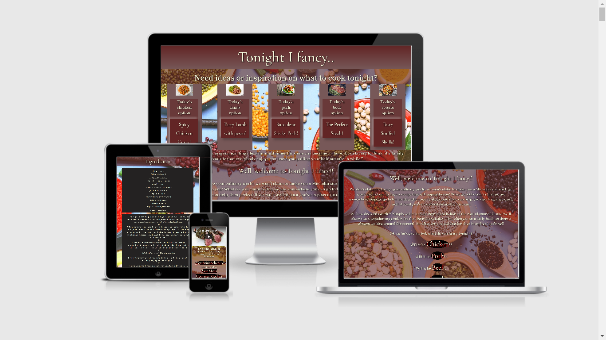
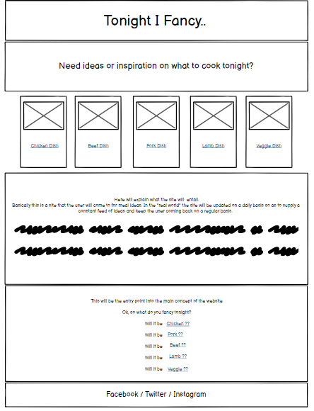
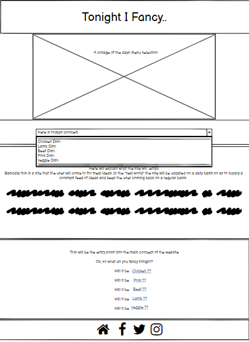
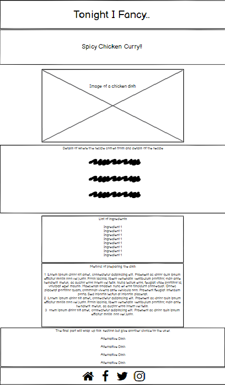
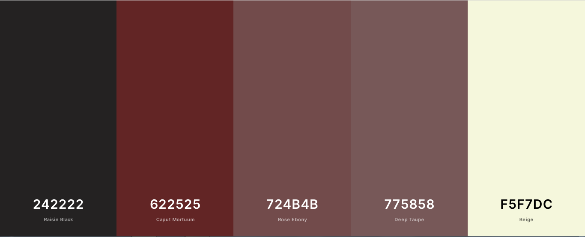
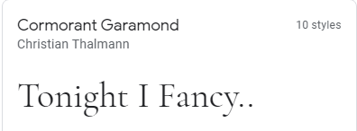
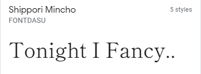

# <u>Milestone Project 1</u>

 

## [Link to live site 'Tonight I Fancy..'](https://jamiewilson2000.github.io/MS1TonightIFancy/)

# User Story

- For my first Milestone project I decided to design a website that would in the real world environment, potentially become a go-to site for ideas and inspiration regarding meal times. As I've been working on the site the ideas that have been coming to mind assure me that this is a site that could be developed into an attractive, useful brand. I feel that the site could appeal to a variety of users,
    - User 1: Would be a family simply looking for a meal idea for that evening.
    - User 2: Would be the same family but this time they would be looking to plan for the week ahead with a variety of meals.
    - User 3: Would be an existing food brand looking to get their recipes appearing on the website.

# Contents

## - [The 5 planes of UX](#the-5-planes-of-ux)
## - [Early Stages](#early-stages)
## - [The Website Features](#the-website-features)
## - [The Coding Languages and Techniques Used](#the-coding-languages-and-techniques-used)
## - [User Interaction](#user-interaction)
## - [Methods of Testing](#methods-of-testing)
## - [Credits](#credits)

 

# The 5 planes of UX

- When thinking on designing this site i took into mind the 5 planes that had been highlighted during the course previously. This made the overall process easier to plan-out.

- ## <u>The strategy</u>
    - After recently being diagnosed with food intolerants, meal times have become more of a talking point in my household. Even before, trying to decide what to make for dinner was a chore but now it's a little more difficult. 
This led me to thinking how handy it would be if there was a website (and I know there are thousands!) that gave you an idea, you select what the main element would be, and the site would offer up a suggestion. It's claim is to not be anything it's not with no fancy bells and whistles. It simply does what it says on the tin!

- ## <u>The Scope</u>
    - Before settling on this idea I had also planned and fiddled with creating a site based on a web magazine, but it became apparent that I was punching a little above my weight. Therefore, back at the drawing board, I decided to keep the whole site very simple.
    I planned for the landing page to have a preview of the day's 5 menu options, a brief introduction to the aim of the site and lastly a list of 5 main ingredients of which to determine which menu option suits best.

- ## <u>The Structure</u>
    - As mentioned previously, I have learnt my limitations over the course of this project so my plan for this site was to keep it very simple. I wanted a site that would be accessible to young and old, therefore, I felt that the best user interface would be one of simplicity. Basically the structure would only consist of two real elements, the landing page and a recipe page. In this manner, you arrive on the page and essentially with one click you would arrive at your destination, your purpose for visiting the site.

- ## <u>The Skeleton</u>
    - Most of the design elements were scribbled out on paper, with the final approaches sketched out in Balsamiq. However I felt the real design element came together when the actual coding began. If something worked then I'd expand on it and if it didn't I would omit it for a simpler, more in keeping with my skillset, option. 

- ## <u>The Surface</u>
    - At this stage was where the most changes were made, changing fonts around, adding color elements, etc. Some things worked, somethings didn't, but the bones of the site remained in place and I am now faced with a project that I'm relatively happy with given my current skillset.
    ---
# Early Stages

 

- These are the 3 wireframes which I planned to use within the site. As stated before, very plain, straightforward design to get the user to their required purpose with minimal fuss or confusion. 
- My original plan was to have the 5 cards in desktop view maintain visibility throughout into mobile views but I felt that it became too cluttered so I opted that once reaching a lower resolution, they should "collapse" into a dropdown menu bar, still with active links directing the user to their required purpose. 
- My original plan for the recipe pages was to have an image of the dish on offer at the forefront of the page but I wasn't content that an image would be enough so I opted to have tutorial videos of each dish, offering a walkthrough of how to prepare the dish. I felt that this makes for a more enticing approach when dealing with food.
- My original plan for the social links in the footer was to use the written word rather than the usual icon approach, however after having the option reviewed by my family members the general concensus was to stick with what people expect to see which is the social icons. Also, this gives the site a small element of global appeal for those that don't speak english as they will still recognise the icons. 

- The color scheme I chose was one through personal preferences. I personally would associate a wine color with food so I felt that the scheme would suit the site content appropriately. I ran a contrast check on the two colours representing body and text and returned a 4/5 star rating so I was happy to go on ahead.
- I adopted:
    - #622525 as the main theme of the site
    - #f5f7dc is the color of the text
    - #62252599 as a backing for textual areas 
    - #775858 is the backing for the menu cards
    - #724b4b is the color for hovering on a button within the menu cards
    - #622525 fading to #775858 would be the base for the top banner and the dropdown menu
    - #775858 fading to #622525 woudl be the base for the footer
    - #242222 is the backing color of the information boxes (Ingredients and recipe method)

- I used a text-shadow effect on the clickable text buttons incorporating the #f5f7dc text color with a red border on a black background in the hope that this will make them stand out as interactive.
- To enhance the text I used a text-shadow effect on all textual items giving a lift to the text and creating continuity throughout the site. On this occasion I used a black coloring for the shadow.
- For added styling I used the -webkit-linear-gradient- method on the main banner, the dropdown menu, and the footer to give a fade effect.
- For defining the buttons on the menu cards that appear on the landing page I used a method called neumorphism to make the buttons stand out and appear as an interactive element.

- For the textual elements I imported in two font familys from Google Fonts.
    - 
    - Cormorant Garamond is used throughout as the brand text.
    - 
    - Shippori Mincho is used in the larger bodys of text.
    

# The Website Features

- ## <u>As Submitted</u>
    - The finished website as it stands is a simplistic, very approachable site. One page to welcome the user and explain it's purpose with essentially one other page featuring the users selected choice.
    - I purposely decided to leave out a navigation button because I felt on this site it wouldn't be a necessary item. The options are right in front of the user. Perhaps as the site developed with more features there would be a need for one but for now I'm wanting to stick to the minimalistic style.
    - Navigation around the site consists of simple links. Each menu card on the landing page is selectable for accessing the selected option. On smaller screens the five card menu options become a dropdown menu, again with the five dinner choices all selectable to take the user to their choice. Additionally, at the bottom of the landing page there are the five choices of main ingredients, Chicken, Pork, Beef, Lamb, and Vegetarian, again all selectable links.  
    The "recipe" page features a welcome banner, a tutorial video on how to make the selected dish, a list of the required ingredients, and the method for making the dish. Additionally, if the user decides the recipe is not the one they want, the remaining options are still at the bottom of the page, giving the user the opportunity to select another option.
    - As standard I have included social media links to Facebook, Twitter and Instagram which in the real world would all link to the business pages, at the moment they take the user to the log-in section of each. On the "recipe" pages, I have also included a link back to the homepage should the user wish to return to the start. The main banner title "Tonight I Fancy.." is also selectable in the "recipe" pages to take you back to the main page.
    - By means of support I have also made the titles of those responsible for providing the recipe and the tutorial videos selectable, taking the user to their respective home sites.

- ## <u>Features I would include in the future</u>
    - I would like to have the 5 cards on the landing page revolve in a carousel. I feel that would give the site a nicer feel and also would translate better to mobile views.
    - Moving on from the sites current state, I would like to see it developed into a more sustainable entity. This would include: 
    - The current state is that of a basic plan, a free plan, 5 ingredients, 5 meal choices. I would envisage that there could be a sign-up with a small monthly fee which would entitle the user to more ingredient options and more meal choices for each ingredient.
    - I would like to see affiliations with other sites similar to Listonic wherein you can save and transfer your ingredients to a shopping list application. Similar to that, I would like to have an ability to save selected ingredients into a database on the site which can then be accessed as a shopping list on a mobile device.
    - I would like a method of recording how many hits each recipe/ingredient recieved over a period of time to gauge how popular each item is. This information would then be used to determine future options and choices.
    - Outside of the coding aspect, I would envisage employing staff to create our own tutorial videos and so putting a face to the brand of "Tonight I Fancy.."

# The Coding Languages and Techniques Used

- This site was constructed using:
    - HTML5
    - CSS3
    - Bootstrap 4.2.1
    - Fontawesome
    - Google Fonts: 'Cormorant Garamond' and 'Shippori Mincho'

# User Interaction

- The following elements are selectable:
    -   The Landing Page:
        - The five cards each take the user to the selected meal option.
        - The five ingredient options also take the user to the meal option for that ingredient.
        - There are three social link icons in the footer, each take the user to the relevant social media site opening in a new page.
    
    - The Mobile Landing Page:
        - In place of the card menu preview, there is now a dropdown menu featuring the 5 meal option and again, each option will take the user to the relevant page. 
        - The five ingredient options are still in place as are the social links in the footer.

    - The Recipe Pages:
        - The "Tonight I Fancy.." title in the top banner will take the user back to the home page.
        - The video is playable within it's own place.
        - The name of the recipe supplier when selected will take the user to their own website in a new tab.
        - The name of the tutorial supplier when selected will take the user to their own website in a new tab.
        - The four remaining ingredient options after the recipe will take the user to the relevant page.
        - The additional home icon in the footer will take the user back to the home page.
        - The orignal social link icons will take the user to the relevant social media site in a new tab.

# Methods of Testing

- Throughout the development stage I used a handful of methods to ensure the site looked and acted how i felt appropriately.  These included:

    - Chrome Dev Tools - for testing stylings, sizing, and responsiveness

    - Mozilla Dev Tools - for testing stylings, sizing, and responsiveness

    - http://ami.responsivedesign.is/ - again for testing stylings, sizing, and responsiveness.

    - https://coolors.co/ - for picking color schemes and testing contrast colors

    - Github Pages - to access the live site across different devices

- Towards the end of the creative process I began to regularly push any changes made to the live site so I was able to test the site on:

    - Samsung A50 phone
    - Apple iPhone 8
    - Apple iPhone 11
    - Fire HD 10.1 tablet
    - Huawei Mediapad 8" tablet

- Also throughout the creative process I would run the code through The W3C Markup Validation Service to try to keep on top of any problems that may arise as a result of my workings. I found this to be a very effective way to keep problems to a minimum and a great way of expanding my coding knowledge. At the end of the process I am happy that this document has no errors or warnings from the W3 HTML Validation check and the css file validates as CSS level 3 + SVG. 

    

# Credits

Throughout the creation of this project I have referred to the following for assistance:

- Coding hints, tips, tricks, and advice:
    - https://codeinstitute.net/
    - https://www.w3schools.com
    - https://stackoverflow.com/
    - https://css-tricks.com/
    - blog.theodo.com/2018/01/responsive-iframes-css-trick/

- Images and videos used throughout this project have been sourced from:

    - https://www.delish.com
    - https://www.foodiewithfamily.com
    - https://www.greatbritishchefs.com
    - https://www.thekitchn.com
    - https://www.youtube.com

- Acknowledgement

    - I would like to thank Code Institute for the knowledge and the motivation shown to me up to this point. As a  complete newbie to coding I am so proud that thanks to CI I have the ability to acheive this creation. I look forward to the rest of the course and a new future career.

# - [Back to top](#contents)

