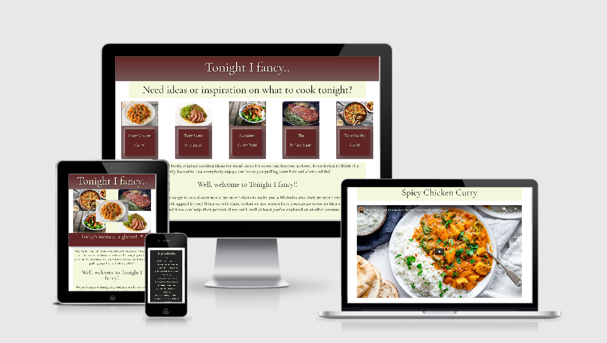
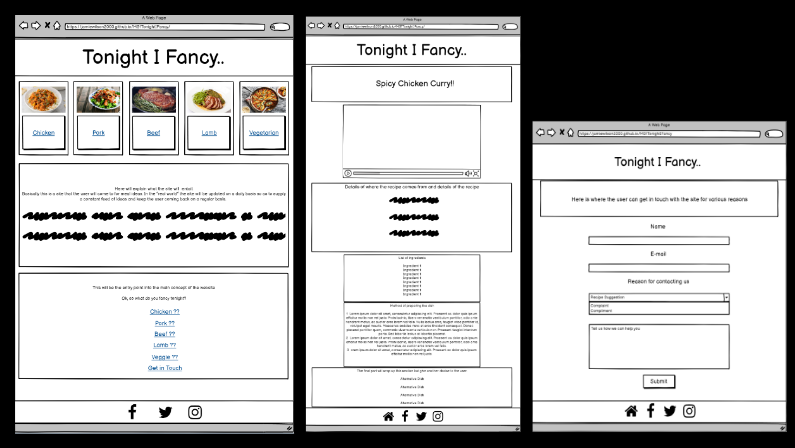
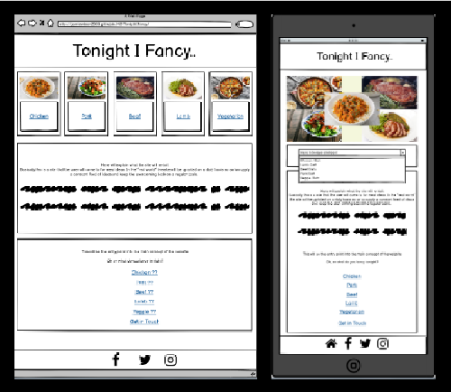
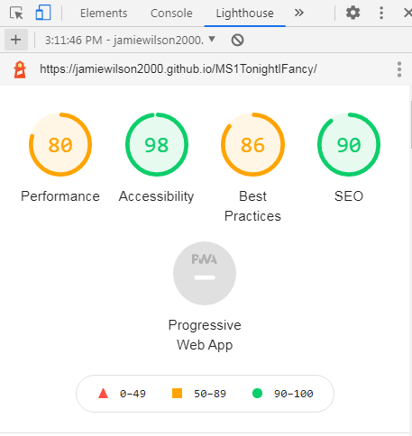

# <u>Milestone Project 1</u>

 

## [Link to live site 'Tonight I Fancy..'](https://jamiewilson2000.github.io/MS1TonightIFancy/)

# Contents

## - [User Story](#user-story)
## - [The 5 planes of UX](#the-5-planes-of-ux)
## - [Early Stages](#early-stages)
## - [The Website Features](#the-website-features)
## - [User Interaction](#user-interaction)
## - [The Coding Languages and Techniques Used](#the-coding-languages-and-techniques-used)
## - [Method of Deployment](#method-of-deployment)
## - [Methods of Testing](#methods-of-testing)
## - [Credits](#credits)

 

# User Story

- For my first Milestone project I decided to design a website that would in the real world environment, potentially become a go-to site for ideas and inspiration regarding meal times. As I've been working on the site the ideas that have been coming to mind assure me that this is a site that could be developed into an attractive, useful brand. I feel that the site could appeal to a variety of users,
    - User 1: Would be a family simply looking for a meal idea for that evening.
    - User 2: Would be the same family but this time they would be looking to plan for the week ahead with a variety of meals.
    - User 3: Would be an existing food brand looking to get their recipes appearing on the website.

- Site objectives for new users
    - To be instantly aware of the sites content and intentions
    - To be completely clear and confident on how to navigate around the site
    - To essentially be able to reach the users outcome with the minimum of 2-3 clicks
    - To be attractive enough and have enough content to entice the user back the following day for an update

- Site objectives for returning users
    - To maintain structure and content to promote familiarity with returning users
    - To maintain a strong, familiar navigation system and in the event of new elements added then to incorporate them into existing navigation system

- The potential for the site is limitless, I would envisage that as the site grew with more elements and the incorporation of affiliated apps then this could take the guesswork out of meal times, fashion a menu of family favourites catered for and created through the users choices to date, whilst introducing new and exciting ideas bought to the user by established and up-coming names in the cooking world. 

# The 5 planes of UX

- When thinking on designing this site i took into mind the 5 planes that had been highlighted during the course previously. This made the overall process easier to plan-out.

- ## <u>The strategy</u>
    - After recently being diagnosed with food intolerants, meal times have become more of a talking point in my household. Even before, trying to decide what to make for dinner was a chore but now it's a little more difficult. 
This led me to thinking how handy it would be if there was a website (and I know there are thousands!) that gave you an idea, you select what the main element would be, and the site would offer up a suggestion. It's claim is to not be anything it's not with no fancy bells and whistles. It simply does what it says on the tin!

- ## <u>The Scope</u>
    - Before settling on this idea I had also planned and fiddled with creating a site based on a web magazine, but it became apparent that I was punching a little above my weight. Therefore, back at the drawing board, I decided to keep the whole site very simple.
    I planned for the landing page to have a preview of the day's 5 menu options, a brief introduction to the aim of the site and lastly a list of 5 main ingredients of which to determine which menu option suits best.

- ## <u>The Structure</u>
    - As mentioned previously, I have learnt my limitations over the course of this project so my plan for this site was to keep it very simple. I wanted a site that would be accessible to young and old, therefore, I felt that the best user interface would be one of simplicity. Basically the structure would only consist of two real elements, the landing page and a recipe page. In this manner, you arrive on the page and essentially with one click you would arrive at your destination, your purpose for visiting the site.

- ## <u>The Skeleton</u>
    - Most of the design elements were scribbled out on paper, with the final approaches sketched out in Balsamiq. However I felt the real design element came together when the actual coding began. If something worked then I'd expand on it and if it didn't I would omit it for a simpler, more in keeping with my skillset, option. 

- ## <u>The Surface</u>
    - At this stage was where the most changes were made, changing fonts around, adding color elements, etc. Some things worked, somethings didn't, but the bones of the site remained in place and I am now faced with a project that I'm relatively happy with given my current skillset.
    ---
# Early Stages

## Wireframes

- Above is a summary of the wireframes for this site (The desktop view). The basis of the site is very simple. One main landing page, one structure for the page that will contain the recipes (content will change but the structure remains the same), and one contact form page. Below are the links to the full images and their respective mobile views.

- [Link to landing page desktop view](https://share.balsamiq.com/c/eMg2JwSLNLEsbUcpqXfnKC.png)
- [Link to landing page tablet view](https://share.balsamiq.com/c/e9qrf4JpR9oH29szhn2XGS.png)
- [Link to landing page mobile view](https://share.balsamiq.com/c/k9EaqVvPdenyYevpicYLL7.png)
- [Link to recipe page desktop view](https://share.balsamiq.com/c/2k2aNtfyidV688EyzEVcpq.png)
- [Link to recipe page tablet view](https://share.balsamiq.com/c/xdbav1WS1dSE72RkE265d2.png)
- [Link to recipe page mobile view](https://share.balsamiq.com/c/nTc6VqJWrX9oho3kCVBL6T.png)
- [Link to contect form page desktop view](https://share.balsamiq.com/c/fXaQj3AzUv6NeiK7V916yE.png)
- [Link to contact form page tablet view](https://share.balsamiq.com/c/8nzk9FAJzCtPk5EaJGdKb6.png)
- [Link to contact form page mobile view](https://share.balsamiq.com/c/h6MeRkABov439RS5VxLrD4.png)

- As you can see from the image above, the biggest transition will be how the landing page translates to the mobile view. I opted for a simple collage of the menu options, (a) to add color and interest to the screen and (b) to give an immediate visual representation of whats on offer 
- There are the 3 wireframes which I planned to use within the site. As stated before, very plain, straightforward design to get the user to their required purpose with minimal fuss or confusion.
- My original plan was to have the 5 cards in desktop view maintain visibility throughout into mobile views but I felt that it became too cluttered so I opted that once reaching a lower resolution, they should "collapse" into a dropdown menu bar, still with active links directing the user to their required purpose. A collage image should be present giving a visual representation of the dishes on offer. 
- My original plan for the recipe pages was to have an image of the dish on offer at the forefront of the page but I wasn't content that an image would be enough so I opted to have tutorial videos of each dish, offering a walkthrough of how to prepare the dish. I felt that this makes for a more enticing approach when dealing with food.
- My original plan for the social links in the footer was to use the written word rather than the usual icon approach, however after having the option reviewed by my family members the general concensus was to stick with what people expect to see which is the social icons. Also, this gives the site a small element of global appeal for those that don't speak english as they will still recognise the icons. 

## Colour Schemes

- The color scheme I chose was one through personal preferences. I personally would associate a wine color with food so I felt that the scheme would suit the site content appropriately. I ran a contrast check on the two colours representing body and text and returned a 4/5 star rating so I was happy to go on ahead.
- I adopted:
    - #622525 as the main theme of the site banner
    - #f5f7dc is the background color of the main body of text
    - #dbddc4 as a variation on the background color for use with the selectable elements
    - #775858 is the backing for the menu cards
    - #724b4b is the color for hovering on a button within the menu cards
    - #622525 fading to #775858 would be the base for the top banner and the dropdown menu
    - #775858 fading to #622525 would be the base for the footer
    - #242222 is the backing color of the information boxes (Ingredients and recipe method)
    - I opted for no background color preferring the clean white approach 

- I used a box-shadow effect on the clickable text buttons incorporating the #622525 theme color for the text in the hope that this will make them stand out as interactive.
- For added styling I used the -webkit-linear-gradient- method on the main banner and the footer to give a fade effect.
- For defining the buttons on the menu cards that appear on the landing page I used a method called neumorphism to make the buttons stand out and appear as an interactive element. I also decided to incorporate this method with all selectable elements bar the social icons.
- I also adopted the neumorphism inset method on the contact form. I wanted to keep the form very simple so I felt that interest should come from a styling perspective.

## Fonts

- For the textual elements I imported in two font familys from Google Fonts.

    - 
    - Cormorant Garamond is used throughout as the brand text.

    - 
    - Shippori Mincho is used in the larger bodys of text.

    

# The Website Features

- ## <u>As Submitted</u>
    - The finished website as it stands is a simplistic, very approachable site. One page to welcome the user and explain the sites purpose, and from there the user will navigate to the recipe they wish to view. There is also a contact form for getting in touch with suggestions, complaints or compliments. At this stage of my skillset I have the user redirected back to the homepage once the submit button has been selected so as to keep the flow of the site constant.
    - I purposely decided to leave out a navigation button because I felt on this site it wouldn't be a necessary item. The options are right in front of the user. Perhaps as the site developed with more features there would be a need for one but for now I'm wanting to stick to the minimalistic style.
    - Navigation around the site consists of simple links. Each menu card on the landing page is selectable for accessing the selected option. On smaller screens the five card menu options become a dropdown menu, again with the five dinner choices all selectable to take the user to their choice. Additionally, at the bottom of the landing page there are the five choices of main ingredients, Chicken, Pork, Beef, Lamb, Vegetarian and the 'Get in Touch' option, again all selectable links.  
    The "recipe" page features a welcome banner, a tutorial video on how to make the selected dish, a list of the required ingredients, and the method for making the dish. Additionally, if the user decides the recipe is not the one they want, the remaining options are still at the bottom of the page, giving the user the opportunity to select another option.
    - As standard I have included social media links to Facebook, Twitter and Instagram which in the real world would all link to the business pages, at the moment they take the user to the log-in section of each. On the "recipe" pages, I have also included a link back to the homepage should the user wish to return to the start. The main banner title "Tonight I Fancy.." is also selectable in the "recipe" pages to take you back to the main page but I chose not to highlight it's usability, treat it more of an 'easter egg' that users can discover. There is the homepage icon at the bottom of the screen so the user should not feel stuck.
    - By means of support I have also made the titles of those responsible for providing the recipe and the tutorial videos selectable, taking the user to their respective home sites.

- ## <u>Features I would include in the future</u>
    - I would like to have the 5 cards on the landing page revolve in a carousel. I feel that would give the site a nicer feel and also would translate better to mobile views.
    - Moving on from the sites current state, I would like to see it developed into a more sustainable entity. This would include: 
    - The current state is that of a basic plan, a free plan, 5 ingredients, 5 meal choices. I would envisage that there could be a sign-up with a small monthly fee which would entitle the user to more ingredient options and more meal choices for each ingredient.
    - I would like to add an option for the user to "favourite" a recipe to be added to their own personal favourite menu, so as to make their navigation around the site even easier and quicker when re-visiting.
    - I would like to see affiliations with other sites similar to Listonic wherein you can save and transfer your ingredients to a shopping list application. Similar to that, I would like to have an ability to save selected ingredients into a database on the site which can then be accessed as a shopping list on a mobile device.
    - I would like a method of recording how many hits each recipe/ingredient recieved over a period of time to gauge how popular each item is. This information would then be used to determine future options and choices.
    - Outside of the coding aspect, I would envisage employing staff to create our own tutorial videos and so putting a face to the brand of "Tonight I Fancy.."
    - When selecting the links to those who supplied the recipes and tutorials, I would have ideally liked the sites to open within my own site but seemingly there is an issue with opening https sites within https sites. This is something that I'm sure can be worked around but at the moment it's an addition for the future.

# User Interaction

- The following elements are selectable:
    -   The Landing Page:
        - The five cards each take the user to the selected meal option.
        - The five ingredient options also take the user to the meal option for that ingredient.
        - The 'Get in Touch' option to navigate the user to the contact form.
        - There are three social link icons in the footer, each take the user to the relevant social media site opening in a new page.
    
    - The Mobile Landing Page:
        - In place of the card menu preview, there is now a dropdown menu featuring the 5 meal option and again, each option will take the user to the relevant page. 
        - The five ingredient options are still in place as is the contact form link and the social links in the footer.

    - The Recipe Pages:
        - The "Tonight I Fancy.." title in the top banner will take the user back to the home page.
        - The video is playable within it's own frame.
        - The name of the recipe supplier when selected will take the user to their own website in a new tab.
        - The name of the tutorial supplier when selected will take the user to their own website in a new tab.
        - The four remaining ingredient options after the recipe will take the user to the relevant page.
        - The additional home icon in the footer will take the user back to the home page.
        - The orignal social link icons will take the user to the relevant social media site in a new tab.

    - The Contact Form:
        - The 'Name' field is where the user will leave their name to be used in correspondance.
        - The 'E-mail' field is where the user will leave their e-mail address for future correspondance.
        - The 'Reason for contacting us' field will help narrow down the options as to why the user is contacting us.
        - The 'Tell us how...' field informs the user that this is where more details can be given and also informs them that after hitting the submit button the user will be returned back to the home-page.
        - The 'Submit' button would essentially post the information to the required body and return the user back to the homepage.

# The Coding Languages and Techniques Used

- This site was constructed using:
    - HTML5
    - CSS3
    - Bootstrap 4.2.1
    - Fontawesome
    - Google Fonts: 'Cormorant Garamond' and 'Shippori Mincho'

- For the menu cards (index.html line 36 - 72) I used the card component element from [Bootstrap Card componant](https://getbootstrap.com/docs/4.2/components/card/)4.2.1 and adjusted the styling and use of the element to fit within my sites environment. Example of one card shown here:

        

            
            

                <a href="chicken.html" class="btn btn-primary">Spicy Chicken Curry!</a>
            

        

- For the dropdown menu (index.html line 76 - 88) I used the dropdown element from [Bootstrap Dropdown componant](https://getbootstrap.com/docs/4.2/components/dropdowns/) 4.2.1 and adjusted the styling and use of the element to fit within my sites environment. Example shown here:

        

            
            

                <a class="dropdown-item" href="chicken.html">Chicken Curry</a>
                <a class="dropdown-item" href="lamb.html">Lamb with Pesto</a>
                <a class="dropdown-item" href="beef.html">Hanger Steak</a>
                <a class="dropdown-item" href="pork.html">Sticky Pork</a>
                <a class="dropdown-item" href="vegetarian.html">Stuffed Shells</a>
            

        

- For the Contact Form (contact.html) I adopted a form style element from [Bootstrap Form Groups](https://getbootstrap.com/docs/4.2/components/forms/#form-groups)4.2.1 and adjusted the elements and styling to fit within my sites environment. Example shown here:

        

            <form>
                <label for="fname">Name</label> 
                <input type="text" id="fname" name="name" class="inputwidth"> 
                <label for="email">E-mail</label> 
                <input type="email" id="email" name="email" class="inputwidth">
                

                

                    <label for="formchoice">Reason For Contacting Us :</label>
                     
                    <select class="form-control" id="formchoice">
                        <option>Select An Option</option>
                        <option>Recipe Suggestion</option>
                        <option>Complaint</option>
                        <option>Other</option>
                    </select>
                

            </form>
            

            <form action="index.html">
                

                <textarea class="comment"
                    placeholder="Tell us how we can help you and once you hit submit you'll be taken back to the home-page!"></textarea> 
                

                <input type="submit" name="submit" value="Submit" style="margin-bottom:20px">
            </form>
        

- For the decorative page breaks shown throughout the recipe method sections I imported the icon from [Fontawesome 4.7 pagelines](https://fontawesome.com/v4.7.0/icon/pagelines). Example shown here:

        <li><i class="fa fa-pagelines" aria-hidden="true"></i></li>

- For the social icons included in the footers (line numbers vary throughout) I imported the icons from [Fontawesome 4.7 social network](https://fontawesome.com/v4.7.0/icon/). Example shown here:

        <footer class="footer">
            <nav>
                <a href="https://www.facebook.com/" target="_blank"> <i class="fa fa-facebook"></i></a>
                <a href="https://www.twitter.com/" target="_blank"> <i class="fa fa-twitter"></i></a>
                 <a href="https://www.instagram.com/" target="_blank"> <i class="fa fa-instagram"></i></a> 
            </nav>                        
        </footer>

- For the inclusion of tutorial videos within the recipe pages I located the required video from [Youtube.com](https://www.youtube.com/embed/MmU1sXsnp3s), selected the share option, selected the embed option and copied the iframe information into my code and adjusted the styling to fit within my sites environment. Example shown here:

        <iframe class="iframe" width="1182" height="665" src="https://www.youtube.com/embed/MmU1sXsnp3s"
            allow="accelerometer; autoplay; clipboard-write; encrypted-media; gyroscope; picture-in-picture"
            allowfullscreen>
        </iframe>

- To give the illusion of the clickable elements being raised like physical buttons I turned to an article called [Neumorphism and CSS](https://css-tricks.com/neumorphism-and-css/) from a site called [css-tricks.com](https://css-tricks.com/) and adopted their approach within my site. I used this method to both raise my 'buttons' to stand out and to inset the input fields on my contact form. Example shown here:

        .btn{
            width: 100%;
            height: 160px;
            border-radius: 11px;
            color: #f5f7dc;
            background-color: #622525;
            box-shadow: 12px 12px 16px 0 rgba(0, 0, 0, 0.25), -8px -8px 12px 0 rgba(255, 255, 255, 0.3);
        }
        .btn:focus {
            outline: 0;
            box-shadow: 12px 12px 16px 0 rgba(0, 0, 0, 0.25)inset, -8px -8px 12px 0 rgba(255, 255, 255, 0.3)inset;
        }

# Method of Deployment

- To fully test the site on multiple 'real-world' devices I needed to create a live link to the site that could be accessed universally. To do this, a simple procedure is required. 

    - Step 1: Open Github.com and sign in.
    - Step 2: Once signed in you should see your repositorys in chronological order.
    - Step 3: Select the repository you wish to create a link for and once selected click the settings tab on the page.
    - Step 4: Within the settings page you will be given the option to rename the repository, add an image to customize your social media preview, and many other options to be explored at a later date.
    - Step 5: Scroll down and you will find the heading for GitHub Pages.
    - Step 6: At this stage the 'source' field should read 'none' so click on the button and select 'master'
    - Step 7: Once this is selected, hit save and the page should refresh bringing you back to the top.
    - Step 8: Scroll back down to the Github pages section and you will now see a message informing the user that the site is ready to be published and a highlighted link. Make a note of the link address for future reference or click the link to access the site direct. 

- From this point on you can type in and access your site on any device with an internet browser which is ideal for testing purposes.

# Methods of Testing

- Throughout the development stage I used a handful of methods to ensure the site looked and acted appropriately.  These included:

    - Chrome Dev Tools - for testing stylings, sizing, and responsiveness

    - Mozilla Dev Tools - for testing stylings, sizing, and responsiveness

    - http://ami.responsivedesign.is/ - again for testing stylings, sizing, and responsiveness.

    - https://coolors.co/ - for picking color schemes and testing contrast colors

    - Github Pages - to access the live site across different devices

    - Google Lighthouse - to test perfomance 

## Summary of User Testing

- For this I employed my wife to use the site as she had very little idea on how the site was structured.  Points raised were:
    - I initially had the #622525 theme color running throughout the whole site with a strong background image fleshing out the background (See Example 1), the user found the whole site a little overwhelming and felt the text didn't stand out as well as possibly could.
        - As a result of this feedback I redesigned the color scheme as represented now. (See Example 2)

    - The user felt there was little need for the menu cards to have three sections (See Example 1), an image, a description, and a button with the meal title.
        - As a result of this feedback I removed the middle section featuring the description (See Example 2).

    - The user was able to navigate around the site with very little effort but felt the clickable elements would benefit some form of identification.
        - As a result of this feedback I adopted neumorphism into the site to give the elements a raised effect.

    - The user felt the tutorial videos reaching the full width of the screen was too overpowering for the page and even prevented the user from knowing there was more content below.
        - As a result of this feedback I reduced the size of the tutorial videos to be inline with other elements on the page.

    Example 1 
     
    Example 2 

    
    - Overall the user testing was a positive affair. The user was able to grasp the intentions of the site, with minimal effort was able to browse through the menu options, accessed the external links to visit the contributors webpages, and generally felt the sites purpose was acheived in an enjoyable manner. The user felt that the site was perhaps more suited to a mobile premise which I took on board. In the real-world environment the majority of the sites users would be accessing it on mobile devices rather than on desktops.

    ## Bugs and problems I experienced along way

    - In all honesty I experienced a lot of bugs and problems along the way which I am disappointed and ashamed to admit that I did not log. As they arose I dealt with them, either through logical retracking of steps, re-adjustment to previously changed code, reviewing a previous module again, or to consult one of the many fantastic coding help sites online to try and figure out what was going on. I also adopted the approach to code with caution. Add code/styling and check immediately for negative effects, in the event of a negative effect, reverse or remove said code and approach the task differently. Also, I ran all the code through the html and the css validators on a regular basis so in the event of a piece of rogue code cropping up, I was able to rectify the problem before it potentially made matters worse.
    I have listed below a couple of recent problems that arose towards the end of the writing and testing phase 

    - To add interest to the Ingredient and Method sections of the recipe page I wanted to add an icon to break up the text, this I did using an icon I gained from the Fontawesome site. Upon running the code through the html validator it came to my attention that I had nested a non-list item inside an unordered list which was deeming my code to show up with errors. To fix this I simply nested the icon inside of a < li > tag for the icon to essentially be read as a list item.

                    <li><i class="fa fa-pagelines" aria-hidden="true"></i></li>
    
    - For the clickable ingredient items I was reluctant to use Bootstrap buttons and opted for simple < a > attributes styled to resemble buttons,

            <a href="chicken.html">Chicken</a>

        however, this caused me problems with text spilling out of the styled areas at different resolutions. This I resolved by adjusting the left and right padding at different points of the mobile styling.

    - To increase performance in Google Lighthouse it was suggested to use a < link > attribute when accessing external fonts instead of the @import option that I had currently used, so I implemented the advice and my overall performance increased. 
    Before:

            @import url('https://fonts.googleapis.com/css2?family=Cormorant+Garamond:ital,wght@1,500&display=swap');
            
        After:  

            <link rel="preconnect" href="https://fonts.gstatic.com">
            <link href="https://fonts.googleapis.com/css2?family=Cormorant+Garamond:ital,wght@1,500&display=swap" rel="stylesheet">   
    
    - Something I noticed in the testing stage was when accessing my site through the Slack community app on my Samsung A50 mobile phone, the colors were completely different to my chosen color scheme. This caused me to re-evaluate and try to emulate this effect on the laptop using different browsers (Chrome and Mozilla) and on my Fire HD tablet with it's built in browser (Silk), and finally on an Apple Ipad and iPhone (Safari). On every device the colors ran true apart from on the Samsung. I eventually tried opening my link in Chrome on the Samsung mobile and the colors were correct, this is a matter I had no answer for but a lesson learned for the future.

- Towards the end of the creative process I began to regularly push any changes made to the live site so I was able to test the site on:

    - Samsung A50 phone
    - Apple iPhone 8
    - Apple iPhone 11
    - Fire HD 10.1 tablet
    - Huawei Mediapad 8" tablet

- Also throughout the creative process I would run the code through The W3C Markup Validation Service to try to keep on top of any problems that may arise as a result of my workings. I found this to be a very effective way to keep problems to a minimum and a great way of expanding my coding knowledge. At the end of the process I am happy that this document has no errors or warnings from the W3 HTML Validation check and the css file validates as CSS level 3 + SVG. 

    

- My final audit from Google lighthouse read a respectable 
 

# Credits

## Credits for each dish:

## Chicken Curry
- Image - https://hips.hearstapps.com/del.h-cdn.co/assets/17/31/1501791674-delish-chicken-curry-horizontal.jpg?crop=1.00xw:0.750xh;0,0.159xh&resize=1200:*
- Recipe - https://www.delish.com/cooking/recipe-ideas/recipes/a54696/easy-indian-chicken-curry-recipe/
- Tutorial Video - https://www.youtube.com/watch?v=MmU1sXsnp3s 

## Tasty Lamb with Pesto
- Image - https://gbc-cdn-public-media.azureedge.net/img13079.768x512.jpg
- Recipe - https://www.greatbritishchefs.com/recipes/lamb-pesto-recipe
- Tutorial Video - https://www.youtube.com/watch?v=qGVUBq5jzZg

## Sticky Pork
- Image - https://www.foodiewithfamily.com/wp-content/uploads/2015/07/Easy-Garlic-Ginger-Sticky-Glazed-Pork-3-680x453.jpg
- Recipe - https://www.foodiewithfamily.com/easy-garlic-ginger-glazed-sticky-pork/
- Tutorial Video - https://www.youtube.com/watch?v=tBOJRlkXmao

## The Perfect Steak
- Image - https://cdn.apartmenttherapy.info/image/upload/f_auto,q_auto:eco,c_fit,w_730,h_487/k%2Farchive%2F2816f86937ebc7019a513d858cec8e0c55d38890
- Recipe - https://www.delish.com/cooking/recipe-ideas/a30326606/grilled-hanger-steak-recipe/
- Tutorial Video - https://www.youtube.com/watch?v=46eRIxVxkG8

## Vegetarian Stuffed Shells
- Image - https://assets.epicurious.com/photos/5be1c1bf587ad42d4b37c134/6:4/w_620%2Ch_413/Vegetarian-Skillet-Stuffed-Shells-01112018.jpg
- Recipe - https://www.epicurious.com/recipes/food/views/vegetarian-skillet-stuffed-shells
- Tutorial Video - https://www.youtube.com/watch?v=z1EzYPa6Qy4

## Throughout the creation of this project I have referred to the following for assistance and guidance:

- https://codeinstitute.net/
- https://www.w3schools.com
- https://stackoverflow.com/
- https://css-tricks.com/
- blog.theodo.com/2018/01/responsive-iframes-css-trick/

# Acknowledgement

- I would like to thank Code Institute for the knowledge and the motivation shown to me up to this point. I would also like to thank my mentor Gurjot Singh for his advice in completing this project. As a  complete newbie to coding I am so proud that thanks to CI I have the ability to acheive this creation. I look forward to the rest of the course and a new future career.

# - [Back to top](#contents)

