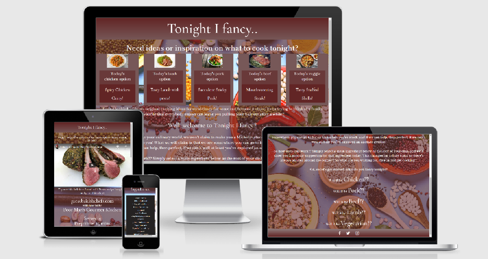

# <u>Milestone Project 1</u>

# Tonight I Fancy.. 

## [Link to live Github hosted website](https://jamiewilson2000.github.io/MS1TonightIFancy/)

- For my first Milestone project I decided to design a website that would in the real world environment, potentially become a go-to site for ideas and inspiration regarding meal times. As I've been working on the site the ideas that have been coming to mind assure me that this is a site that could be developed into an attractive, useful brand.

# Contents

## - [The 5 planes of UX](#the-5-planes-of-ux)
## - [The Website Features](#the-website-features)
## - [The Coding Languages and Techniques Used](#the-coding-languages-and-techniques-used)
## - Methods of testing
## - Credits

 

# The 5 planes of UX

- When thinking on designing this site i took into mind the 5 planes that had been highlighted during the course previously. This made the overall process easier to plan-out.

- ## <u>The strategy</u>
    - After recently being diagnosed with food intolerants, meal times have become more of a talking point in my household. Even before, trying to decide what to make for dinner was a chore but now it's a little more difficult. 
This led me to thinking how handy it would be if there was a website (and I know there are thousands!) that gave you an idea, you select what the main element would be, and the site would offer up a suggestion. It's claim is to not be anything it's not with no fancy bells and whistles. It simply does what it says on the tin!

- ## <u>The Scope</u>
    - Before settling on this idea I had also planned and fiddled with creating a site based on a web magazine, but it became apparent that I was punching a little above my weight. Therefore, back at the drawing board, I decided to keep the whole site very simple.
    I planned for the landing page to have a preview of the day's 5 menu options, a brief introduction to the aim of the site and lastly a list of 5 main ingredients of which to determine which menu option suits best.

- ## <u>The Structure</u>
    - As mentioned previously, I have learnt my limitations over the course of this project so my plan for this site was to keep it very simple. I wanted a site that would be accessible to young and old, therefore, I felt that the best user interface would be one of simplicity. Basically the structure would only consist of two real elements, the landing page and a recipe page. In this manner, you arrive on the page and essentially with one click you would arrive at your destination, your purpose for visiting the site.

- ## <u>The Skeleton</u>
    - Most of the design elements were scribbled out on paper, with the final approaches sketched out in Balsamiq. However i fel the real design element came together when the actual coding began. If something worked then I'd expand on it and if it didn't I would omit it for a simpler, more in keeping with my skillset, option. 

- ## <u>The Surface</u>
    - At this stage was where the most changes were made, changing fonts around, adding color elements, etc. Some things worked, somethings didn't, but the bones of the site remained in place and I am now faced with a project that I'm relatively happy with given my current skillset.

# The Website Features

- ## <u>As Submitted</u>
    - The finished website as it stands is a simplistic, very approachable site. One page to welcome the user and explain it's purpose with essentially one other page featuring the users selected choice.
    - Navigation around the site consists of simple links. Each menu card on the landing page is selectable for accessing the selected option. On smaller screens the five card menu options become a dropdown menu, again with the five dinner choices all selectable to take the user to their choice. Additionally, at the bottom of the landing page there are the five choices of main ingredients, Chicken, Pork, Beef, Lamb, and Vegetarian, again all selectable links.  
    The "recipe" page features a welcome banner, a tutorial video on how to make the selected dish, a list of the required ingredients, and the method for making the dish. Additionally, if the user decides the recipe is not the one they want, the remaining options are still at the bottom of the page, giving the user the opportunity to select another option.
    - As standard I have included social media links to Facebook, Twitter and Instagram which in the real world would all link to the business pages, at the moment they take the user to the log-in section of each. On the "recipe" pages, I have also included a link back to the homepage should the user wish to return to the start. The main banner title "Tonight I Fancy.." is also selectable in the "recipe" pages to take you back to the main page.
    - By means of support I have also made the titles of those responsible for providing the recipe and the tutorial videos selectable, taking the user to their respective home sites.

- ## <u>Features I would include in the future</u>
    -Moving on from the sites current state, I would like to see it developed into a more sustainable entity. This would include: 
    - The current state is that of a basic plan, a free plan, 5 ingredients, 5 meal choices. I would envisage that there could be a sign-up with a small monthly fee which would entitle the user to more ingredient options and more meal choices for each ingredient.
    - I would like to see affiliations with other sites similar to Listonic wherein you can save and transfer your ingredients to a shopping list application. Similar to that, I would like to have an ability to save selected ingredients into a database on the site which can then be accessed as a shopping list on a mobile device.
    - I would like a method of recording how many hits each recipe/ingredient recieved over a period of time to gauge how popular each item is. This information would then be used to determine future options and choices.

# The Coding Languages and Techniques Used

- This site was constructed using:
    - HTML5
    - CSS3
    - Bootstrap 4.2.1
    - Google Fonts: 'Cormorant Garamond' and 'Shippori Mincho'

Sources: 
blog.theodo.com/2018/01/responsive-iframes-css-trick/